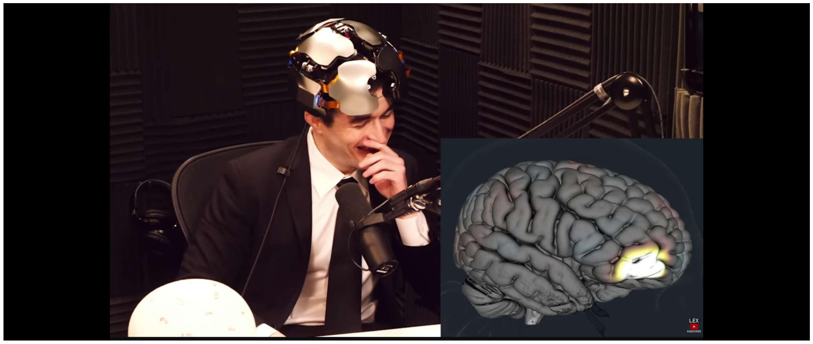
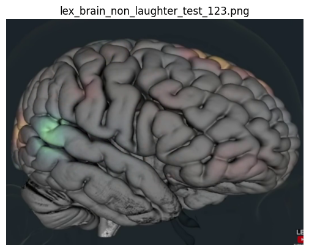
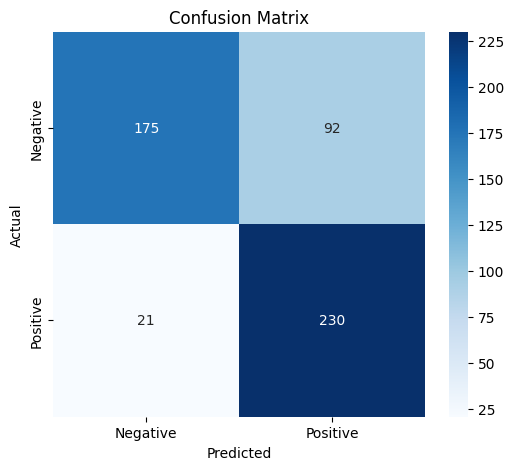

# kernel-brain-data
This is a repository to leverage kernel brain data to detect laughter.

## About the Neural Network Model

This model will take an image of the kernel brain and determine whether the individual is actively laughing.
Note: The text on the image is shown here for reference only and is not included during model prediction.

The Kernel Neural Image model Convolutional Neural Network alone achieves accurate results on predicting laughter vs. non-laughter when an input image of the live kernel brain is used as input to the network. The model uses pre-trained weights from resnet-18 as well as frames from the Lex Fridman podcast. 

The confusion matrix of the results are below, and the model is publicly available for download and use.

## Confusion Matrix

### Metrics
| Class        | Precision | Recall | F1-score | Support |
|-------------|-----------|--------|----------|---------|
| Non-Laughter| 0.89      | 0.66   | 0.76     | 267     |
| Laughter    | 0.71      | 0.92   | 0.80     | 251     |
| **Accuracy**   |           |        | **0.78**  | 518     |
| **Macro Avg**  | 0.80      | 0.79   | 0.78     | 518     |
| **Weighted Avg** | 0.81   | 0.78   | 0.78     | 518     |

| Metric        | Value  |
|--------------|--------|
| Accuracy     | 0.7819 |
| Precision    | 0.7143 |
| Recall       | 0.9163 |
| F1-Score     | 0.8028 |
| ROC AUC      | 0.7859 |

## Model Availability

The model is publicly available as the [neural_image_classifier_model.pth](/models//neural_image_classifier_model.pth) and an example use of the model is shown in the notebook [Neural_Model_Example_Use.ipynb](/notebooks/Neural_Model_Example_Use.ipynb).

The model is also available on huggingface [here](https://huggingface.co/evdev3/kernel-neural-image-laughter-classifier).

## Data Availability

The training and test data is available on huggingface [here](https://huggingface.co/datasets/evdev3/kernel-neural-data)

## Potential Future Developments

In the future, this repo may be used to develop a mixture-of-experts model consisting of multi modalities including facial expression, body pose, audio laughter detection, and image analysis of the kernel brain images.
These neural networks would be trained independently and applied to a gated network in order to scale the output predictions by the proportional magnitude of the available input data to the Mixture-of-Experts model.

